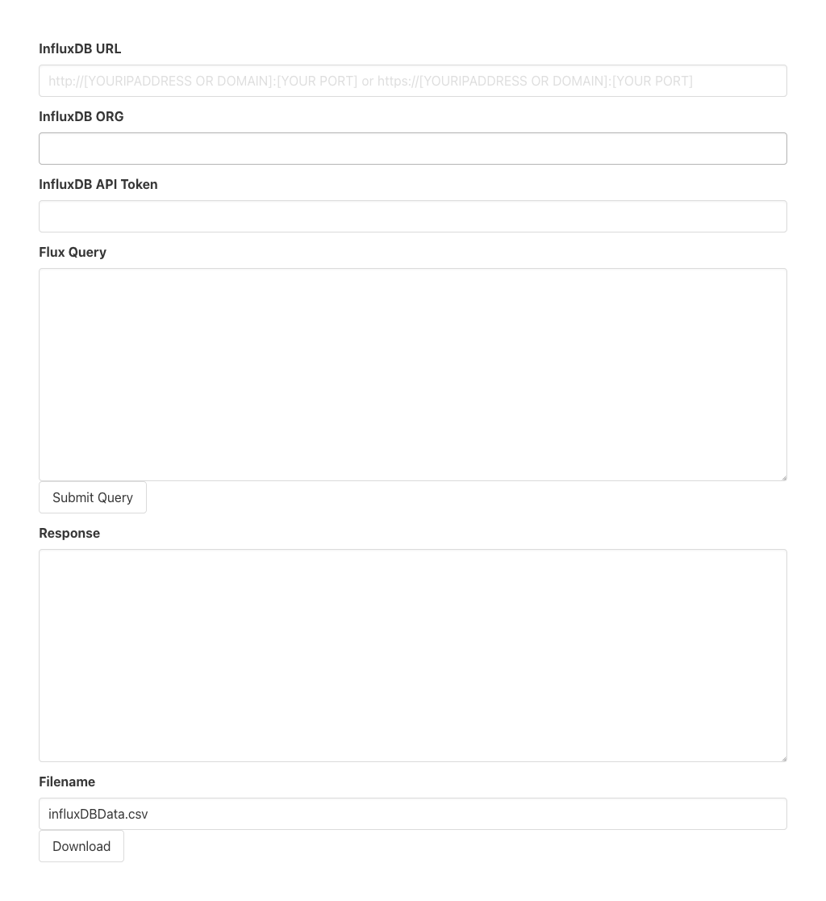

# InfluxDB Query2CSV

This is a simple website that allows to download the CSV data result for a flux query.
The only reason this project exists is because InfluxDB, for some unknown reason, dropped the CSV download button in their data explorer.

## Prerequisites

1. Download and install the latest version of NodeJS on your system.
(See [NodeJS Downloads](https://nodejs.org/en/download))
2. In a shell/cmd navigate to the folder containing this README
3. Run the following command to install dependencies: `npm install`

## Usage

1. In a shell/cmd navigate to the folder containing this README
2. Run the the following command to start the webserver: `npm run serve`
3. Visit <http://localhost:9999>
4. Enter the URL to your instance of InfluxDB (Example <http://127.0.0.1:8086>)
5. Enter the ORG your want to access
6. Enter the API Token you generated ([How to create a token](https://docs.influxdata.com/influxdb/cloud-serverless/admin/tokens/create-token/))
7. Enter a Flux Query and click submit. If everything worked the resulting CSV data is shown in the Response field.
8. Optionally change the filename under which the CSV data should be downloaded, then click Download

### Website View

